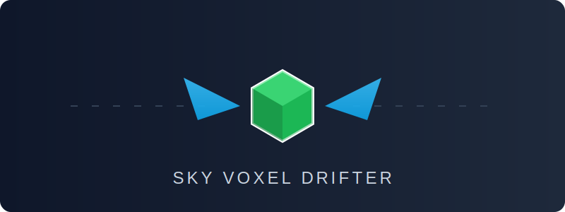
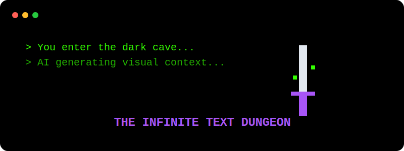
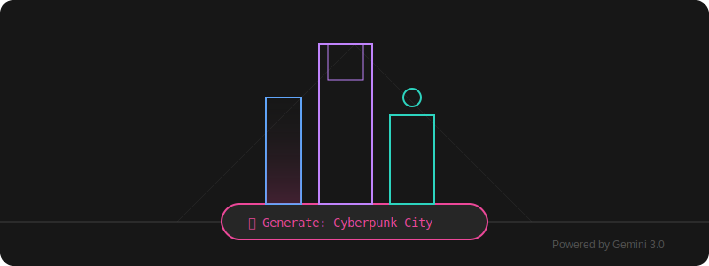
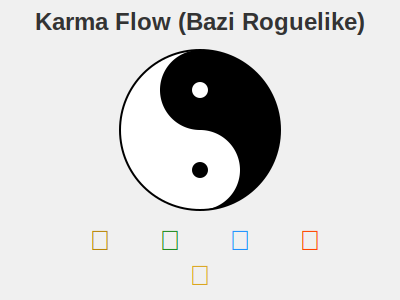

# Awesome Gemini 3.0 Pro Game Collection

## 📖 Introduction

**Awesome Gemini 3.0 Pro Game Collection** is an open-source experimental project that pushes the boundaries of Web technologies fused with Generative AI.

Our goal is simple: **To integrate multiple innovative gameplay mechanics driven by AI into a single web portal.** We combine Three.js/WebGL for high-performance graphics with Large Language Models (like Gemini 3.0 Pro) acting as the "God Engine" to generate narratives, visual assets (SVG/Pixel Art), and logic code in real-time.

> **Core Philosophy:** Games shouldn't be limited to pre-baked content. Your API Key is the passport to an infinite world.

-----

## 🎮 Game List

We are currently developing the following core game modules:

### 1\. ⚔️ Sky Voxel Drifter

  * **Genre:** 3D Action / Parkour
  * **Gameplay:** A high-performance web version of "Minecraft + Elytra Flight". Experience ultimate aerodynamics, use fireworks for boosting, and drift through procedurally generated floating islands.
  * **Tech Stack:** Three.js, Cannon.js (Physics).
  *   * 

### 2\. 🌌 The Infinite Text Dungeon

  * **Genre:** AI-Native RPG / Interactive Fiction
  * **Gameplay:**
      * A text adventure with no boundaries. Your wildest actions ("Try to convince the slime to invest in Bitcoin") are rationalized by the AI to drive the plot.
      * **Real-time Visualization:** Every time the scene description updates, the AI generates a pixel-art style background image on the fly for immersion.
  * **API Configuration (BYOK):**
      * Users provide their own `API Key`, `Base URL`, and `Model Name` in the settings panel.
      * Supports OpenAI, Anthropic, or any OpenAI-compatible Local LLM.
  * **Fallback Mode:**
      * If no API Key is provided, the game automatically switches to **"Curated Script Mode"**.
      * Players enjoy high-quality, pre-written static storylines (No token usage, but limited paths).
       * 
### 3\. 🏙️ Dream City Builder

  * **Genre:** Idle Builder / Generative UI
  * **Gameplay:**
      * **Text-to-City:** You input a description (e.g., "A cyberpunk city built on giant glowing mushrooms").
      * **Powered by Gemini 3.0:** The game backend calls Gemini 3.0 Pro to output complex **SVG code** directly.
      * The frontend renders these SVGs in real-time to construct unique buildings and decorations.
  * **Tech Highlight:** Using LLM's code generation capabilities to replace traditional 3D modeling workflows.
  *  * 
### 4\. ☯️ Karma Flow (Bazi Roguelike)

  * **Genre:** Chinese Metaphysics Roguelike
  * **Gameplay:**
      * **Bazi Deck Building:** Your birth date (Four Pillars of Destiny) is randomly generated at the start. The Five Elements (Metal, Wood, Water, Fire, Earth) determine your base stats and skill deck.
      * **Cycles of Luck:** Each level represents one year of life. You must use elemental interactions (Creation/Destruction cycles) to survive "Bad Luck Years" and dominate during "Golden Ages".
  * **Tech Stack:** Lunar-javascript, Pixi.js.
 * 
-----

## ⚙️ Architecture & Config

This project adopts an **"AI-Optional"** architecture. Core game logic runs locally, while AI features enhance the experience via API.

### Global Settings Panel

Click the ⚙️ icon in the top right corner to configure:

```json
{
  "ai_provider": "custom", // or "gemini", "openai"
  "base_url": "https://generativelanguage.googleapis.com/v1beta/openai/",
  "api_key": "sk-proj-...",
  "model_name": "gemini-1.5-pro-latest",
  "image_generation_enabled": true
}
```

  * **Status:** 🟢 Connected / 🔴 Offline (Fallback mode active)

-----

## 🚀 Getting Started

```bash
# 1. Clone the repository
git clone https://github.com/your-username/awesome-gemini-game.git

# 2. Navigate to directory
cd awesome-gemini-game

# 3. Install dependencies
npm install

# 4. Start development server
npm run dev
```

Open your browser at `http://localhost:3000` to start playing.